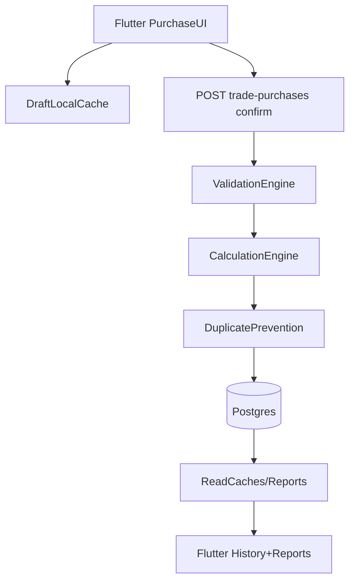

# 00 — Master Architecture (Wholesale Purchase OS)

**Root spec (authoritative).** Updated: 2026-05-06.

## Core goal

Build an enterprise-grade **wholesale purchase operating system**: fast, mobile-first, deterministic calculations, packaging-aware units, strict validations, correct reports, AI scanner with preview-confirm-save.

## Non-negotiables

- **No hallucinated data** anywhere (scanner, search, reports).
- **No auto-save of AI output**: always preview → user confirm → save.
- **Deterministic calculation engine**: server is the source of truth.
- **Packaging types allowed only**: `KG`, `BAG`, `BOX`, `TIN`, `PCS`.
  - Remove/forbid `SACK`, `LTR`, duplicated piece names, arbitrary dropdowns.
- **Box/Tin default mode**: track only **count** and **₹/unit**. No kg math unless “advanced inventory mode” is enabled.

## System layers

- **Flutter (Riverpod + go_router)**: fast capture, table-first entry, offline drafts, optimistic UX.
- **FastAPI**: canonical validation + totals + duplicate prevention + audit logs.
- **Postgres** (prod), SQLite (tests/dev): business-scoped (`business_id`) multi-tenant.
- **Reports**: canonical aggregation over `trade_purchases` + `trade_purchase_lines` (SSOT).
- **AI scanner**: hybrid OCR → structured parse → fuzzy match → validate → preview → confirm.

## Canonical data flow (purchase)

## Single source of truth tables

- Purchases: `trade_purchases`
- Lines: `trade_purchase_lines`
- Directory: `suppliers`, `brokers`
- Catalog packaging defaults: `catalog_items` (`default_unit`, `default_kg_per_bag`, etc.)
- Learning (scanner corrections): `catalog_aliases`

## Deliverables tracked by docs

See:
- `01_PACKAGE_ENGINE.md`
- `02_CALCULATION_ENGINE.md`
- `03_DYNAMIC_FORM_RULES.md`
- `04_REPORT_ENGINE.md`
- `05_AI_SCANNER.md`
- `06_VALIDATION_RULES.md`
- `07_DUPLICATE_PREVENTION.md`
- `08_MOBILE_LAYOUT_RULES.md`
- `09_OFFLINE_SYNC.md`
- `11_PDF_TEMPLATE_RULES.md`
- `14_REFRESH_ENGINE.md`

